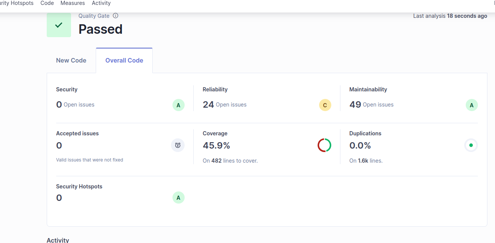

# CS-GradeCalculator

Sistema de cálculo de notas finales para el curso CS3081 de UTEC.

## Resultados de calidad y análisis SonarQube

### Requerido


### Resultado del alumno en SonarQube


## Descripción

Aplicación CLI que permite a los docentes calcular la nota final de los estudiantes considerando:
- Evaluaciones con sus respectivos pesos
- Política de asistencia mínima
- Política de puntos extra (con acuerdo de profesores)

## Características

- Cumple todos los Requerimientos Funcionales (RF01-RF05)
- Cumple todos los Requerimientos No Funcionales (RNF01-RNF04)
- Arquitectura OOP con separación clara de responsabilidades
- Código limpio siguiendo estándares SonarQube
- Tests unitarios con cobertura >85%
- Thread-safe y determinista

## Instalación

```bash
python3 -m venv .venv
source .venv/bin/activate
pip install -r requirements.txt
```

## Uso

```bash
python -m src.cli
```

El sistema guiará al usuario a través del proceso:
1. Ingreso del código del estudiante
2. Registro de evaluaciones (máximo 10)
3. Registro de asistencia mínima
4. Registro de porcentaje de tardanzas (si aplica)
5. Registro de votos de profesores
6. Registro de puntos extra (si aplica)
7. Visualización del resultado con detalle del cálculo

## Estructura del Proyecto

```
src/
├── models/
│   └── evaluation.py          # Clase Evaluation
├── policies/
│   ├── attendance_policy.py   # Clase AttendancePolicy
│   └── extra_points_policy.py # Clase ExtraPointsPolicy
├── calculator/
│   └── grade_calculator.py    # Clase GradeCalculator
├── constants.py               # Constantes del sistema
├── exceptions.py              # Excepciones personalizadas
└── cli.py                     # Interfaz de línea de comandos
tests/
├── test_evaluation.py
├── test_attendance_policy.py
├── test_extra_points_policy.py
├── test_grade_calculator.py
└── test_cli.py
```

## Tests

Ejecutar todos los tests:
```bash
python -m pytest tests/ -v
```

Ejecutar tests con cobertura:
```bash
python -m pytest tests/ --cov=src --cov-report=term-missing
```

Cobertura actual: **85%**

## Requerimientos

- Python 3.8+
- pytest >= 7.4.0
- pytest-cov >= 4.1.0

## Arquitectura

El sistema sigue principios SOLID y Clean Code:
- **Separación de responsabilidades**: Cada clase tiene una responsabilidad única
- **Bajo acoplamiento**: Las clases se comunican a través de interfaces claras
- **Alta cohesión**: Funcionalidad relacionada está agrupada
- **Stateless**: GradeCalculator es thread-safe y determinista


## Ejemplo de Ejecución (Caso de Uso CU001)

A continuación se muestra una sesión de terminal simulando el flujo normal de cálculo de notas, donde un docente ingresa evaluaciones, confirma asistencia y aplica puntos extra:

```console
============================================================
CS-GradeCalculator - Sistema de Cálculo de Notas Finales
============================================================

Ingrese el código o identificador del estudiante: 22

Estudiante: 22

--- Registro de Evaluaciones ---
Máximo de evaluaciones permitidas: 10

Evaluación 1:
  Nota obtenida (0-20): 20
  Peso (%): 50
  ✓ Evaluación registrada: Nota=20.0, Peso=50.0%

¿Desea registrar otra evaluación? (s/n): s

Evaluación 2:
  Nota obtenida (0-20): 11
  Peso (%): 50
  ✓ Evaluación registrada: Nota=11.0, Peso=50.0%

¿Desea registrar otra evaluación? (s/n): n

--- Asistencia Mínima ---
¿El estudiante alcanzó la asistencia mínima? (s/n): s

--- Votos de Profesores del Año ---
Ingrese los votos de los profesores (s/n para cada uno):
(s = de acuerdo con puntos extra, n = en desacuerdo)

Profesor 1 (s/n, o 'fin' para terminar): s
Profesor 2 (s/n, o 'fin' para terminar): s
Profesor 3 (s/n, o 'fin' para terminar): fin

--- Puntos Extra ---
✓ Todos los profesores están de acuerdo. Puede asignar puntos extra.

Ingrese los puntos extra a aplicar (0 o más): 1

============================================================
CALCULANDO NOTA FINAL...
============================================================

Estudiante: 22

--- Detalle del Cálculo ---
Promedio Ponderado: 15.5
Penalización Aplicada: 0.0
Puntos Extra Aplicados: 1.0

============================================================
NOTA FINAL: 16.5
============================================================
```

